<picture>
  <source media="(prefers-color-scheme: dark)" srcset="https://www.mgm-tp.com/global-content/cd/logos/a12/app-icons/dark/A12-Dark.svg" />
  
</picture>

# Test resources

The Data Services Server Application component for A12.

Refer to https://geta12.com/#/docs to get started with A12 development

---

## License

Parts of the A12 platform are made available under a **dual license**.
Please check the [LICENSE](../LICENSE) file for details.

---

## Insurance domain structure
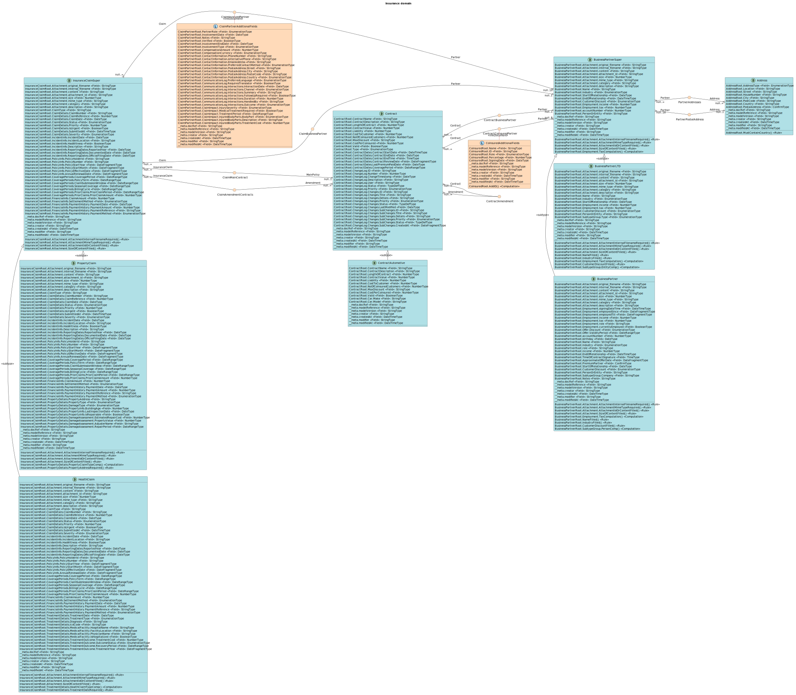\
[PUML diagram](src/main/resources/diagrams/insurance_domain.puml)

## CDM overview
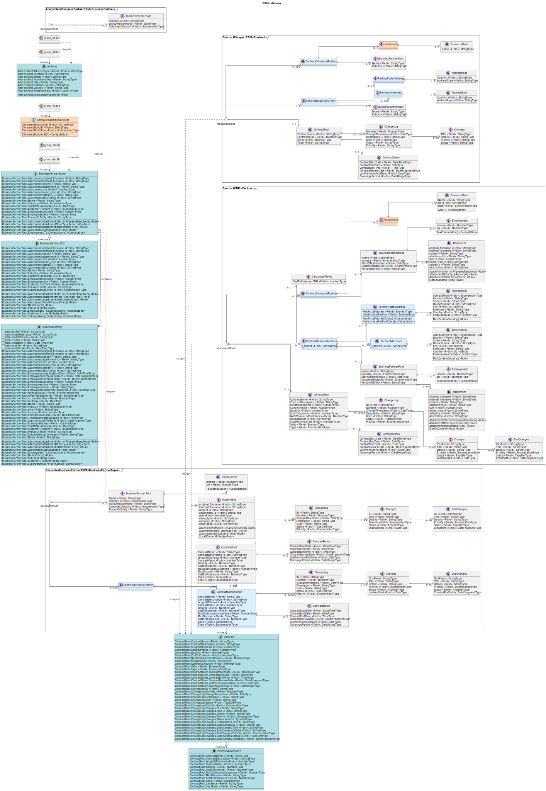\
[PUML diagram](src/main/resources/diagrams/cdm_relations.puml)

## Model diagrams

### Document model diagrams
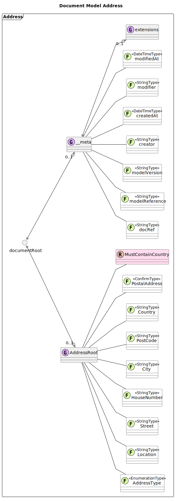\
[PUML diagram](src/main/resources/diagrams/models/generated/Address.puml)

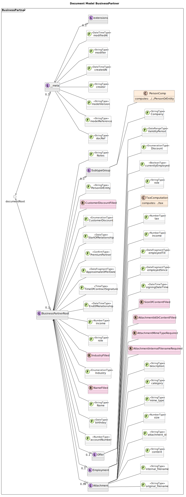\
[PUML diagram](src/main/resources/diagrams/models/generated/BusinessPartner.puml)

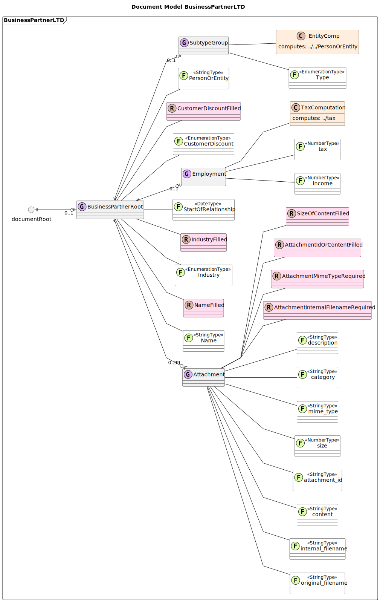\
[PUML diagram](src/main/resources/diagrams/models/generated/BusinessPartnerLTD.puml)

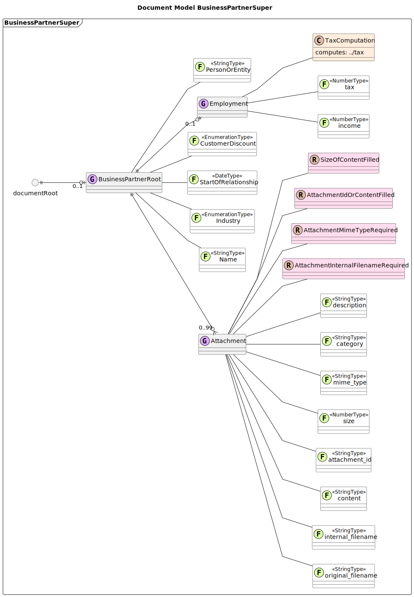\
[PUML diagram](src/main/resources/diagrams/models/generated/BusinessPartnerSuper.puml)

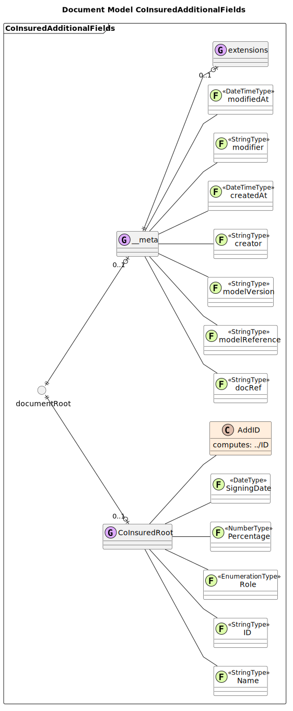\
[PUML diagram](src/main/resources/diagrams/models/generated/CoInsuredAdditionalFields.puml)

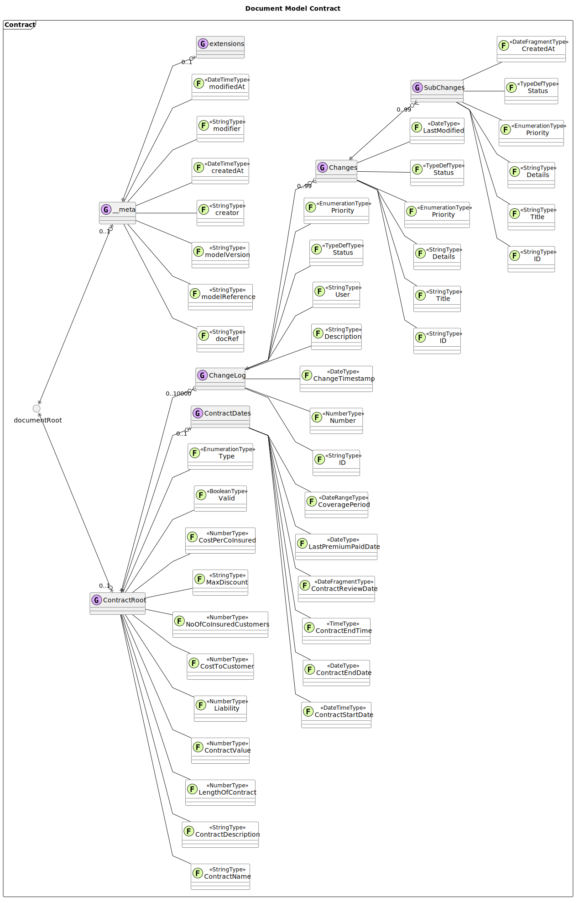\
[PUML diagram](src/main/resources/diagrams/models/generated/Contract.puml)

### CDM diagrams
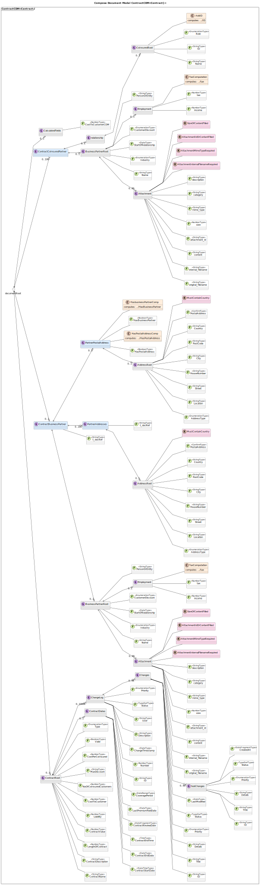\
[PUML diagram](src/main/resources/diagrams/models/generated/ContractCDM.puml)

\
[PUML diagram](src/main/resources/diagrams/models/generated/ContractCompactCDM.puml)

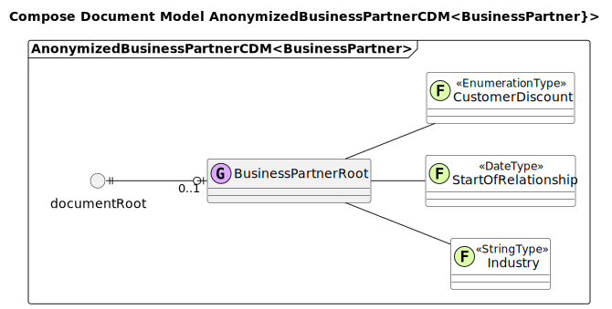\
[PUML diagram](src/main/resources/diagrams/models/generated/AnonymizedBusinessPartnerCDM.puml)

## CDM structure in detail

### ContractCDM
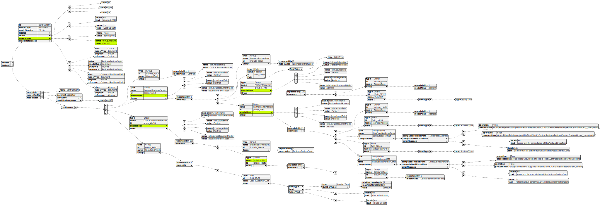\
[PUML diagram](src/main/resources/diagrams/ContractCDM.json.puml)

### AnonymizedBusinessPartnerCDM
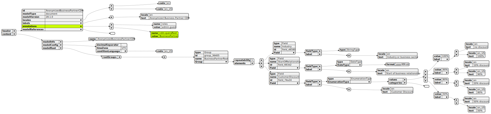\
[PUML diagram](src/main/resources/diagrams/AnonymizedBusinessPartnerCDM.json.puml)

---

## Documentation

- Full technical documentation is available at [GetA12.com](https://GetA12.com).
- The website also provides access to the **A12 Discourse Community Forum**.

---

**The mgm A12 Team**

[mgm technology partners GmbH](https://www.mgm-tp.com) • [Imprint](https://www.mgm-tp.com/imprint.html)

