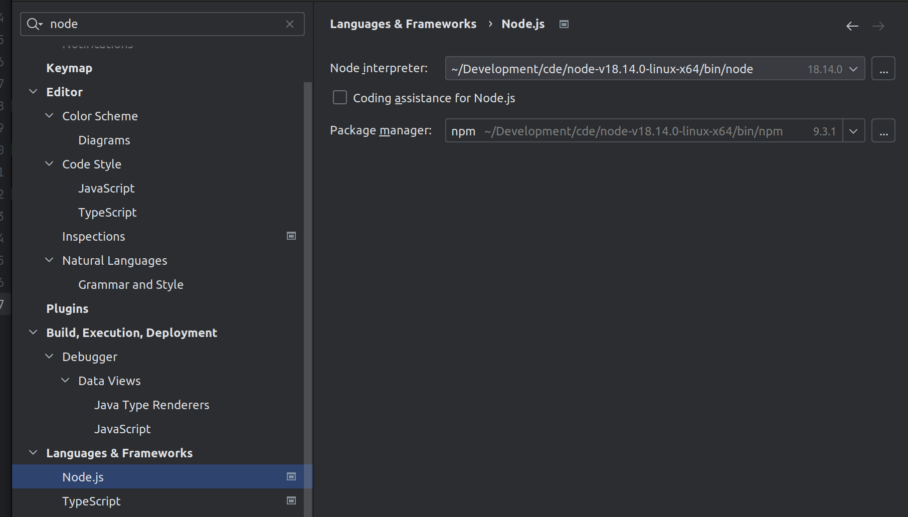
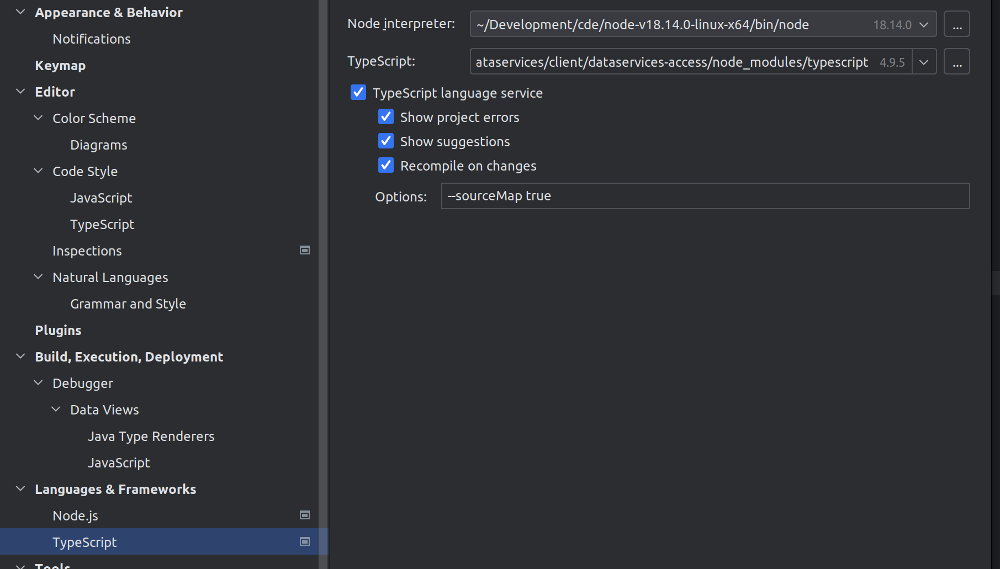
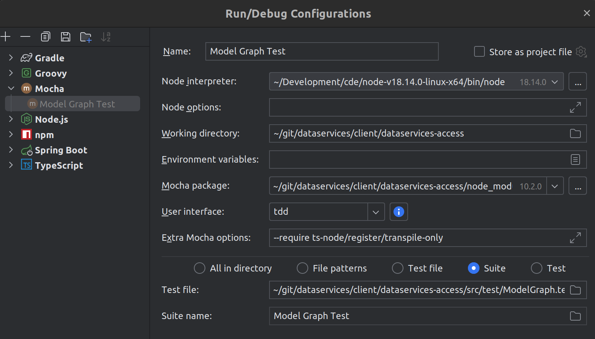

<picture>
  <source media="(prefers-color-scheme: dark)" srcset="https://www.mgm-tp.com/global-content/cd/logos/a12/app-icons/dark/A12-Dark.svg" />
  
</picture>

# Data Services Access library.

Library provides utility functions to create URLs for Data Services endpoints and nominal interfaces for description of requests and responses of those endpoints.

Refer to https://geta12.com/#/docs to get started with A12 development

---

## License

Parts of the A12 platform are made available under a **dual license**.
Please check the [LICENSE](../../LICENSE) file for details.

---

## How to use

- If not done already, run
  - `npm install --legacy-peer-deps`
- Compile TypeScript
  - `npm run compile`
- Run Tests
  - `npm run test`
- Run Tests with Integration
  - `npm run test:integration`

## IntelliJ IDEA setup to run tests

1. Set the CDE's node and typescript:  
2. Add `--require ts-node/register/transpile-only` to mocha options: 

---

## Documentation

- Full technical documentation is available at [GetA12.com](https://GetA12.com).
- The website also provides access to the **A12 Discourse Community Forum**.

---

**The mgm A12 Team**

[mgm technology partners GmbH](https://www.mgm-tp.com) • [Imprint](https://www.mgm-tp.com/imprint.html)
